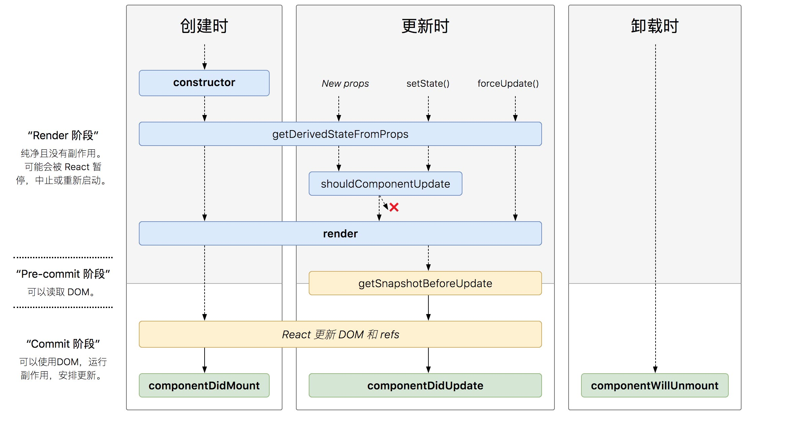

---
nav:
  title: 基础知识
  order: 1
group:
  title: React 17.x 全家桶
  order: 4
title: React(类组件-生命周期)
order: 5
---

# React(类组件-生命周期)

<Alert type="info"> 前言
初始阶段、运行阶段和销毁阶段，在 React 不同的生命周期中，会依次触发不同的钩子函数
</Alert>



```jsx
import React, { Component } from 'react';
 
class MyComponent extends Component {
  constructor(props) {
    debugger
    super(props);
    this.state = {
      counter: 0
    };
  }
 
  componentDidMount() {
    debugger
    console.log('组件已挂载');
  }
 
  componentDidUpdate() {
    debugger
    console.log('组件已更新');
  }
 
  componentWillUnmount() {
    debugger
    console.log('组件即将卸载');
  }
 
  render() {
    debugger
    return (
      <div>
        <p>{this.state.counter}</p>
        <button onClick={() => this.setState({ counter: this.state.counter + 1 })}>
          Increment
        </button>
      </div>
    );
  }
}
 
export default MyComponent;
```

## 1.初始阶段

- **创建前**`constructor`

  设置组件的初始化状态

  ```jsx
  import React,{Component} from 'react'

  class MyComponent extends Component {
    constructor(props){
      super(props)
      this.state={
        num:0
      };
    }
    render(){
      return (
        <div>{this.state.num}</div>
      )
    } 
  }
  export default MyComponent
  ```

- **创建后**`getDerivedStateFromProps`

  ```jsx
  import React,{Component} from 'react';

  class MyComponent extends Component {
    state = {
      num:0
    }
    static getDerivedStateFromProps(props,state){
      return {num:2}
    }
    render(){
      return <div>{this.state.num}</div>
    }
  }
  export default MyComponent
  ```

- **挂载前**`render`

  ```jsx
  import React,{Component} from 'react';

  class MyComponent extends Component {
    state = {
      num:0
    }
    render(){
      return <div>{this.state.num}</div>
    }
  }
  export default MyComponent
  ```

- **挂载后**`componentDidMount`

  ```jsx
  import React,{Component} from 'react';

  class MyComponent extends Component {
    state = {
      num:0
    }
    
    componentDidMount(){
      this.setState({num:10})
    }

    render(){
      return <div>{this.state.num}</div>
    }
  }
  export default MyComponent
  ```

    组件已经被渲染到页面中后触发：此时页面中有了真正的 DOM 元素，可以进行 DOM 相关的操作。

## 2.更新阶段

- **更新前**`getDerivedStateFromProps`

  ```jsx
  import React,{Component} from 'react';

  class MyComponent extends Component {
    state = {
      num:0
    }
    static getDerivedStateFromProps(props,state){
      return {num:2}
    }
    render(){
      return <div>{this.state.num}</div>
    }
  }
  export default MyComponent
  ```

- **是否更新** `shouldComponentUpdate`

  ```jsx
  import React,{Component} from 'react';

  class MyComponent extends Component {
    state = {
      num:0
    }
    shouldComponentUpdate(props,state){
      let res = Math.random()
      return res>0.5
    }
    render(){
      return <div>{this.state.num}</div>
    }
  }
  export default MyComponent
  ```

  组件接收到新属性，或者组件的状态发生改变时触发，组件首次渲染时并不会触发

  ```js
  shouldComponentUpdate(newProps,newState){
      if(newProps.number < 5) return true;
      return false
  }
  //该钩子函数可以接受两个参数，新的属性和状态，返回true/false来控制组件是否需要更新。
  ```

  一般我们通过该函数来优化性能：

  - 一个 React 项目需要更新一个小组件时，很可能需要父组件更新自己的状态。而一个父组件重新更新会造成它旗下所有的子组件重新执行 render()方法，形成性的虚拟 DOM，再用 diff 算法对新旧 DOM 进行结构和属性的比较，决定组件是否需要重新渲染。
  - 这样的操作会造成很多的性能浪费，所以我们开发者可以根据项目的业务逻辑，在`shouldComponentUpdate()`中加入条件判断，从而优化性能。
  - 例如 React 中就提供了一个`PureComponent`的类，当我们的组件继承于它时，组件更新时就会默认先比较新旧属性和状态，从而决定组件是否更新。指的注意的是，`PuerComponent`进行的是浅比较，所以组件状态或者属性改变时，都需要返回一个新的对象或者数组。

- **更新中**`render`

  ```jsx
  import React,{Component} from 'react';

  class MyComponent extends Component {
    state = {
      num:0
    }
    render(){
      return <div>{this.state.num}</div>
    }
  }
  export default MyComponent
  ```

- **更新后**`componentDidUpdate`

    组件被更新完成后触发，页面中产生了新的 DOM 元素，可以进行 DOM

  ```jsx
  import React,{Component} from 'react';

  class MyComponent extends Component {
    state = {
      num:0
    }
    
    componentDidUpdate(){
      this.setState({num:10})
    }

    render(){
      return <div>{this.state.num}</div>
    }
  }
  export default MyComponent
  ```

## 3.销毁阶段

- **销毁前**`componentWillUnmount`

  组件被销毁时触发，这里我们可以进行一些清理操作，例如清理定时器，取消 Redux 的订阅事件。

  ```jsx
  import React,{Component} from 'react';

  class MyComponent extends Component {
    state = {
      num:0
    }
    
    componentWillUnmount(){

    }

    render(){
      return <div>{this.state.num}</div>
    }
  }
  export default MyComponent
  ```
