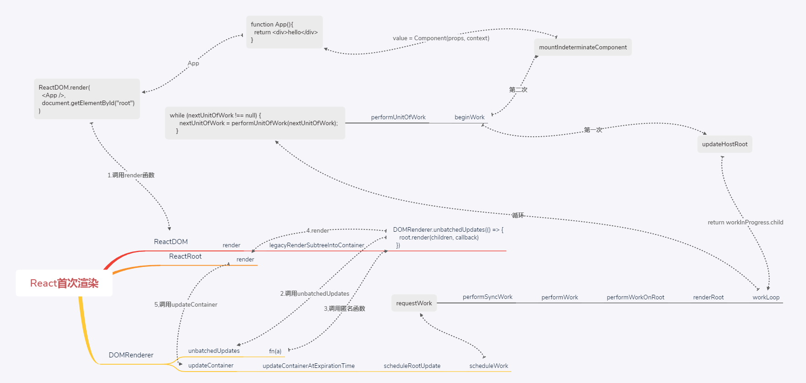

react源码概览
主要步骤：
  - 1.构建`Fiber Tree`
  - 创建一个RootFiber节点
  - 沿着子节点不断创建fiber子节点，如果发现子节点是一个数组，会把子节点都创建好，之后拿到第一个子节点再往下走
  - 如果没有子节点了，就向它的兄弟节点出发；循环上一步操作。
  - 当没有子节点和兄弟节点了，就向上返回父节点。直到root节点完成，这颗fiber树就已经渲染好了，可以提交渲染树到真实的dom树了。
- 2.更新`Fiber Tree`
  - 遍历`Fibre Tree`,找到要更新的节点（有`effectTag`标识），将更新记录在其父节点的`firstEffect`链表上。
  - 向上遍历时，发现上面的父节点`firstEffect`不为空，将更新记录在其父节点上`firstEffect`链表上，同理直到`root`节点上`firstEffect`链表有指向有`effectTag`记录的节点。
  - 更新标记好的节点。

```js
function App(){
  return <div>hello</div>
}
ReactDOM.render(<App />, document.getElementById('root'))
```

## ReactDOM.render
在React中创建更新主要有以下三种方式：
- ReactDOM.render() || hydrate(服务端渲染相关)
- setState
- forceUpdate
- hooks中useState

```js
// 参数
element：{
  "$$typeof": Symbol(react.element),
  "key": null,
  "ref": null,
  "props": {},
  "_owner": null,
  "_store": {}
}
```
```js
render(
  element,
  container, // <div id="root"></div>
  callback,//undefined
) {
  return legacyRenderSubtreeIntoContainer(
    null,
    element,
    container,
    false,
    callback,
  );
}
```
## legacyRenderSubtreeIntoContainer
```js
function legacyRenderSubtreeIntoContainer(
  parentComponent, // null
  children,//同上
  container, // <div id="root"></div>
  forceHydrate, // false
  callback, // undefined
) {
  let root = container._reactRootContainer;
  root = container._reactRootContainer = legacyCreateRootFromDOMContainer(
    container,
    forceHydrate,
  );
  //流程1：执行unbatchedUpdates
  DOMRenderer.unbatchedUpdates(() => {//流程2：执行anonymous
    root.render(children, callback)//流程3：执行React.render
  });
  return DOMRenderer.getPublicRootInstance(root._internalRoot);
}
```
## unbatchedUpdates
```js
function unbatchedUpdates(fn) {
  if (isBatchingUpdates && !isUnbatchingUpdates) {
    isUnbatchingUpdates = true;
    try {
      return fn(a);//流程2：执行anonymous
    } finally {
      isUnbatchingUpdates = false;
    }
  }
  return fn(a);
}
```
## ReactRoot.prototype.render
```js
ReactRoot.prototype.render = function(//流程3：执行React.render
  children,//同上
  callback, // undefined
){
  const root = this._internalRoot;
  const work = new ReactWork();
  DOMRenderer.updateContainer(children, root, null, work._onCommit);
  return work;
}
```
## updateContainer
```js
// 参数
container:  {
  containerInfo: div#root,
  context: null,
  `current`: FiberNode {tag: 3, key: null, elementType: null, type: null, stateNode: {…}, …},
  didError: false,
  earliestPendingTime: 0,
  earliestSuspendedTime: 0,
  expirationTime: 0,
  finishedWork: null,
  firstBatch: null,
  hydrate: false,
  interactionThreadID: 1,
  latestPendingTime: 0,
  latestPingedTime: 0,
  latestSuspendedTime: 0,
  memoizedInteractions: Set(0) {},
  nextExpirationTimeToWorkOn: 0,
  nextScheduledRoot: null,
  pendingChildren: null,
  pendingCommitExpirationTime: 0,
  pendingContext: null,
  pendingInteractionMap: Map(0) {},
  timeoutHandle: -1
}
```
```js
export function updateContainer(
  element,//同上
  container,
  parentComponent,//null
  callback,
) {
  const current = container.current;
  const currentTime = requestCurrentTime();
  const expirationTime = computeExpirationForFiber(currentTime, current);
  return updateContainerAtExpirationTime(
    element,
    container,
    parentComponent,
    expirationTime,
    callback,
  );
}
```
## updateContainerAtExpirationTime
```js
export function updateContainerAtExpirationTime(
  element, // 同上
  container, // 同上
  parentComponent,//null
  expirationTime,//1
  callback,
) {
  const current = container.current;

  const context = getContextForSubtree(parentComponent);
  if (container.context === null) {
    container.context = context;
  } else {
    container.pendingContext = context;
  }

  return scheduleRootUpdate(current, element, expirationTime, callback);
}
```
## scheduleRootUpdate

```js
current: {
    actualDuration: 0
    actualStartTime: -1
    alternate: null
    child: null
    childExpirationTime: 0
    effectTag: 0
    elementType: null
    expirationTime: 0
    firstContextDependency: null
    firstEffect: null
    index: 0
    key: null
    lastEffect: null
    memoizedProps: null
    memoizedState: null
    mode: 0
    nextEffect: null
    pendingProps: null
    ref: null
    return: null
    selfBaseDuration: 0
    sibling: null
    stateNode: {current: FiberNode, containerInfo: div#root, pendingChildren: null, earliestPendingTime: 0, latestPendingTime: 0, …}
    tag: 3
    treeBaseDuration: 0
    type: null
    updateQueue: null
    _debugID: 1
    _debugIsCurrentlyTiming: false
    _debugOwner: null
    _debugSource: null 
  }
```
```js
function scheduleRootUpdate(
  current,
  element,  // 同上
  expirationTime,//1
  callback,
) {
  const update = createUpdate(expirationTime);// 1.创建更新
  update.payload = {element};

  callback = callback === undefined ? null : callback;
  if (callback !== null) {                                 
    update.callback = callback;
  }
  enqueueUpdate(current, update);// 2.将更新放进更新队列，将更新队列绑定到fiber上,也就是current
  scheduleWork(current, expirationTime);// 3.调用scheduleWork进行更新调度
  return expirationTime;
}
```
## scheduleWork
给fiber（current）设置优先级（expirationTime），然后调用`requestWork`
```js
function scheduleWork(
  fiber, // 同上
  expirationTime // 1
 ) {
  const root = scheduleWorkToRoot(fiber, expirationTime);//1.获取当前更新的root节点
  markPendingPriorityLevel(root, expirationTime);//2.将该root加入更新链表
  if (
    !isWorking ||
    isCommitting ||
    nextRoot !== root
  ) {
    const rootExpirationTime = root.expirationTime;
    requestWork(root, rootExpirationTime);
  }
}
```
## requestWork
```js
root:{
  containerInfo: div#root,
  `context`: {},
  current: FiberNode {tag: 3, key: null, elementType: null, type: null, stateNode: {…}, …},
  didError: false,
  `earliestPendingTime`: 1,
  earliestSuspendedTime: 0,
  `expirationTime`: 1,
  finishedWork: null
  firstBatch: null,
  hydrate: false,
  interactionThreadID: 1,
  `latestPendingTime`: 1,
  latestPingedTime: 0,
  latestSuspendedTime: 0,
  memoizedInteractions: Set(0) {},
  `nextExpirationTimeToWorkOn`: 1,
  nextScheduledRoot: null,
  pendingChildren: null,
  pendingCommitExpirationTime: 0,
  pendingContext: null,
  pendingInteractionMap: Map(0) {},
  timeoutHandle: -1
  }
```
```js
function requestWork(
  root,
  expirationTime // 1
 ) {
  addRootToSchedule(root, expirationTime);
  performSyncWork()//同步更新
}
```
## performSyncWork
```js
function performSyncWork() {
  performWork(Sync, null);
}
```
## performWork
```js
function performWork(
  minExpirationTime,//1
  dl
) {
  deadline = dl;
  findHighestPriorityRoot();

  while (
    nextFlushedRoot !== null &&
    nextFlushedExpirationTime !== NoWork &&
    (minExpirationTime === NoWork ||
      minExpirationTime >= nextFlushedExpirationTime)
  ) {
    performWorkOnRoot(nextFlushedRoot, nextFlushedExpirationTime, true);
    findHighestPriorityRoot();
  }

  deadline = null;
  deadlineDidExpire = false;

  finishRendering();
}
```
## performWorkOnRoot
```js
root:{
  containerInfo: div#root
  context: {}
  current: FiberNode {tag: 3, key: null, elementType: null, type: null, stateNode: {…}, …}
  didError: false
  earliestPendingTime: 1
  earliestSuspendedTime: 0
  expirationTime: 1
  finishedWork: null
  firstBatch: null
  hydrate: false
  interactionThreadID: 1
  latestPendingTime: 1
  latestPingedTime: 0
  latestSuspendedTime: 0
  memoizedInteractions: Set(0) {}
  nextExpirationTimeToWorkOn: 1
  `nextScheduledRoot`: {current: FiberNode, containerInfo: div#root, pendingChildren: null, earliestPendingTime: 1, latestPendingTime: 1, …}
  pendingChildren: null
  pendingCommitExpirationTime: 0
  pendingContext: null
  pendingInteractionMap: Map(0) {}
  timeoutHandle: -1
  }
```
```js
function performWorkOnRoot(
  root,
  expirationTime, // 1
  isExpired, //true
) {
  isRendering = true;

  let finishedWork = root.finishedWork;
  root.finishedWork = null;

  const timeoutHandle = root.timeoutHandle;
  const isYieldy = false;//可中断
  renderRoot(root, isYieldy, isExpired);
  finishedWork = root.finishedWork;
  if (finishedWork !== null) {
    completeRoot(root, finishedWork, expirationTime);
  }

  isRendering = false;
}
```
## renderRoot
```js
function renderRoot(
  root,//同上
  isYieldy,//false
  isExpired,//true
) {
  isWorking = true;
  ReactCurrentOwner.currentDispatcher = Dispatcher;

  const expirationTime = root.nextExpirationTimeToWorkOn;

  resetStack();
  nextRoot = root;
  nextRenderExpirationTime = expirationTime;
  nextUnitOfWork = createWorkInProgress(
    nextRoot.current,
    null,
    nextRenderExpirationTime,
  );
  root.pendingCommitExpirationTime = NoWork;

  if (enableSchedulerTracing) {
    const interactions: Set<Interaction> = new Set();
    root.pendingInteractionMap.forEach(
      (scheduledInteractions, scheduledExpirationTime) => {
        if (scheduledExpirationTime <= expirationTime) {
          scheduledInteractions.forEach(interaction =>
            interactions.add(interaction),
          );
        }
      },
    );
    root.memoizedInteractions = interactions;
  }

  let prevInteractions;
  if (enableSchedulerTracing) {
    prevInteractions = __interactionsRef.current;
    __interactionsRef.current = root.memoizedInteractions;
  }

  let didFatal = false;

  startWorkLoopTimer(nextUnitOfWork);

  do {
    try {
      workLoop(isYieldy);//循环所有节点
    } catch (thrownValue) {
    }
    break;
  } while (true);

  if (enableSchedulerTracing) {
    __interactionsRef.current = prevInteractions;
  }

  isWorking = false;
  ReactCurrentOwner.currentDispatcher = null;
  resetContextDependences();

  const didCompleteRoot = true;
  stopWorkLoopTimer(interruptedBy, didCompleteRoot);
  const rootWorkInProgress = root.current.alternate;

  nextRoot = null;
  interruptedBy = null;

  onComplete(root, rootWorkInProgress, expirationTime);
}
```
## workLoop
- 如果不可中断，一直执行到为空为止
- 可中断，根据浏览器空运事件执行performUnitOfWork
```js
function workLoop(
  isYieldy//false,可中断
  ) {
  if (!isYieldy) {
    while (nextUnitOfWork !== null) {
      nextUnitOfWork = performUnitOfWork(nextUnitOfWork);
    }
  }
}
```
## performUnitOfWork1
```js
workInProgress:{
  actualDuration: 0
  actualStartTime: -1
  alternate: FiberNode {tag: 3, key: null, elementType: null, type: null, stateNode: {…}, …}
  child: null
  childExpirationTime: 0
  effectTag: 0
  elementType: null
  expirationTime: 1
  firstContextDependency: null
  firstEffect: null
  index: 0
  key: null
  lastEffect: null
  memoizedProps: null
  memoizedState: null
  mode: 0
  nextEffect: null
  pendingProps: null
  ref: null
  return: null
  selfBaseDuration: 0
  sibling: null
  stateNode: {current: FiberNode, containerInfo: div#root, pendingChildren: null, earliestPendingTime: 1, latestPendingTime: 1, …}
  tag: 3
  treeBaseDuration: 0
  type: null
  updateQueue: {baseState: null, firstUpdate: {…}, lastUpdate: {…}, firstCapturedUpdate: null, lastCapturedUpdate: null, …}
  _debugID: 1
  _debugIsCurrentlyTiming: false
  _debugOwner: null
  _debugSource: null 
}
```
```js
function performUnitOfWork(
  workInProgress
  ){
  const current = workInProgress.alternate;

  startWorkTimer(workInProgress);

  let next;
  if (enableProfilerTimer) {

    next = beginWork(current, workInProgress, nextRenderExpirationTime);
    workInProgress.memoizedProps = workInProgress.pendingProps;

    if (workInProgress.mode & ProfileMode) {
      stopProfilerTimerIfRunningAndRecordDelta(workInProgress, true);
    }
  }

  if (next === null) {
    next = completeUnitOfWork(workInProgress);
  }

  ReactCurrentOwner.current = null;

  return next;
}
```
## beginWork1
```js
current:{
  actualDuration: 0
  actualStartTime: -1
  alternate: FiberNode {tag: 3, key: null, elementType: null, type: null, stateNode: {…}, …}
  child: null
  childExpirationTime: 0
  effectTag: 0
  elementType: null
  expirationTime: 1
  firstContextDependency: null
  firstEffect: null
  index: 0
  key: null
  lastEffect: null
  memoizedProps: null
  memoizedState: null
  mode: 0
  nextEffect: null
  pendingProps: null
  ref: null
  return: null
  selfBaseDuration: 0
  sibling: null
  stateNode: {current: FiberNode, containerInfo: div#root, pendingChildren: null, earliestPendingTime: 1, latestPendingTime: 1, …}
  tag: 3
  treeBaseDuration: 0
  type: null
  updateQueue: {baseState: null, firstUpdate: {…}, lastUpdate: {…}, firstCapturedUpdate: null, lastCapturedUpdate: null, …}
  _debugID: 1
  _debugIsCurrentlyTiming: false
  _debugOwner: null
  _debugSource: null
}
```
```js
function beginWork(
  current,
  workInProgress,//同上
  renderExpirationTime,//1
){
  const updateExpirationTime = workInProgress.expirationTime;
  workInProgress.expirationTime = NoWork;

  switch (workInProgress.tag) {
    case HostRoot:
      return updateHostRoot(current, workInProgress, renderExpirationTime);
  }
}
```
## updateHostRoot
```js
workInProgress:{
  actualDuration: 0
  actualStartTime: -1
  alternate: FiberNode {tag: 3, key: null, elementType: null, type: null, stateNode: {…}, …}
  child: null
  childExpirationTime: 0
  effectTag: 0
  elementType: null
  `expirationTime`: 0
  firstContextDependency: null
  firstEffect: null
  index: 0
  key: null
  lastEffect: null
  memoizedProps: null
  memoizedState: null
  mode: 0
  nextEffect: null
  pendingProps: null
  ref: null
  return: null
  selfBaseDuration: 0
  sibling: null
  stateNode: {current: FiberNode, containerInfo: div#root, pendingChildren: null, earliestPendingTime: 1, latestPendingTime: 1, …}
  tag: 3
  treeBaseDuration: 0
  type: null
  updateQueue: {baseState: null, firstUpdate: {…}, lastUpdate: {…}, firstCapturedUpdate: null, lastCapturedUpdate: null, …}
  _debugID: 1
  _debugIsCurrentlyTiming: false
  _debugOwner: null
  _debugSource: null
}
```
```js
function updateHostRoot(
  current, //同上
  workInProgress,
  renderExpirationTime
  ) {
  pushHostRootContext(workInProgress);
  var updateQueue = workInProgress.updateQueue;
 
  var nextProps = workInProgress.pendingProps;
  var prevState = workInProgress.memoizedState;
  var prevChildren = prevState !== null ? prevState.element : null;
  processUpdateQueue(workInProgress, updateQueue, nextProps, null, renderExpirationTime);
  var nextState = workInProgress.memoizedState;
  var nextChildren = nextState.element;

  var root = workInProgress.stateNode;
  reconcileChildren(current, workInProgress, nextChildren, renderExpirationTime);
  resetHydrationState();
  return workInProgress.child;
}
```
## performUnitOfWork2
```js
workInProgress:{
  `workInProgress` = FiberNode {tag: 2, key: null, stateNode: null, elementType: ƒ, type: ƒ, …}
  `Local`
  `current$$1`: undefined
  `next`: undefined
  `this`: undefined
  `workInProgress`: FiberNode {tag: 2, key: null, stateNode: null, elementType: ƒ, type: ƒ, …}
  `Closure`
  `Closure` (./node_modules/react-dom/cjs/react-dom.development.js)
  `Window`
  `Global`
  `FiberNode`
  actualDuration: 0
  actualStartTime: -1
  `alternate`: null
  child: null
  childExpirationTime: 0
  `effectTag`: 2
  `elementType`: ƒ App()
  `expirationTime`: 1
  firstContextDependency: null
  firstEffect: null
  index: 0
  key: null
  lastEffect: null
  memoizedProps: null
  memoizedState: null
  mode: 0
  nextEffect: null
  `pendingProps`: {}
  ref: null
  `return`: FiberNode {tag: 3, key: null, elementType: null, type: null, stateNode: {…}, …}
  selfBaseDuration: 0
  `sibling`: null
  `stateNode`: null
  `tag`: 2
  treeBaseDuration: 0
  `type`: ƒ App()
  `updateQueue`: null
  `_debugID`: 4
  `_debugIsCurrentlyTiming`: false
  _debugOwner: null
  _debugSource: null
}
```
```js
function performUnitOfWork(
  workInProgress
  ){
  const current = workInProgress.alternate;

  startWorkTimer(workInProgress);

  let next;
  if (enableProfilerTimer) {

    next = beginWork(current, workInProgress, nextRenderExpirationTime);
    workInProgress.memoizedProps = workInProgress.pendingProps;

    if (workInProgress.mode & ProfileMode) {
      stopProfilerTimerIfRunningAndRecordDelta(workInProgress, true);
    }
  }

  if (next === null) {
    next = completeUnitOfWork(workInProgress);
  }

  ReactCurrentOwner.current = null;

  return next;
}
```
## beginWork2
```js
function beginWork(
  current,//null
  workInProgress,//同上
  renderExpirationTime,//1
){
  const updateExpirationTime = workInProgress.expirationTime;
  workInProgress.expirationTime = NoWork;

  switch (workInProgress.tag) {
    case IndeterminateComponent:
      {
        var elementType = workInProgress.elementType;
        return mountIndeterminateComponent(current, workInProgress, elementType, renderExpirationTime);
      }
}
```
## mountIndeterminateComponent
```js
workInProgress:{
  actualDuration: 0
  actualStartTime: -1
  alternate: null
  child: null
  childExpirationTime: 0
  effectTag: 3
  elementType: ƒ App()
  `expirationTime`: 0
  firstContextDependency: null
  firstEffect: null
  index: 0
  key: null
  lastEffect: null
  memoizedProps: null
  memoizedState: null
  mode: 0
  nextEffect: null
  pendingProps: {}
  ref: null
  return: FiberNode {tag: 3, key: null, elementType: null, type: null, stateNode: {…}, …}
  selfBaseDuration: 0
  sibling: null
  stateNode: null
  tag: 2
  treeBaseDuration: 0
  type: ƒ App()
  updateQueue: null
  _debugID: 4
  _debugIsCurrentlyTiming: true
  _debugOwner: null
  _debugSource: null
}
```
```js
function mountIndeterminateComponent(
  _current,//null
  workInProgress,
  Component,//App
  renderExpirationTime,//1
) {

  const props = workInProgress.pendingProps;
  const unmaskedContext = getUnmaskedContext(workInProgress, Component, false);
  const context = getMaskedContext(workInProgress, unmaskedContext);

  prepareToReadContext(workInProgress, renderExpirationTime);

  let value;
  value = Component(props, context)
  workInProgress.effectTag |= PerformedWork;
  workInProgress.tag = FunctionComponent;
  reconcileChildren(null, workInProgress, value, renderExpirationTime);
  return workInProgress.child;
}
```
## App
```js
function App(){
  return <div>hello</div>
}
```
