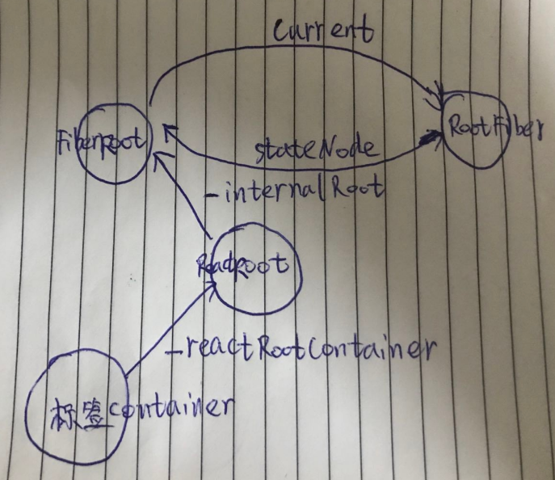

# 创建root
结构示意图


## root
- legacyRenderSubtreeIntoContainer
```js
function legacyRenderSubtreeIntoContainer(
  parentComponent, // null
  children,//同上
  container, // <div id="root"></div>
  forceHydrate, // false
  callback, // undefined
) {
  let root = container._reactRootContainer;
  root = container._reactRootContainer = legacyCreateRootFromDOMContainer(
    container,
    forceHydrate,
  );
}
```
- legacyCreateRootFromDOMContainer
```js
function legacyCreateRootFromDOMContainer(
  container,
  forceHydrate,
) {
  const shouldHydrate =
    forceHydrate || shouldHydrateDueToLegacyHeuristic(container);
  if (!shouldHydrate) {
    let warned = false;
    let rootSibling;
    while ((rootSibling = container.lastChild)) {
      container.removeChild(rootSibling);
    }
  }
  const isConcurrent = false;
  return new ReactRoot(container, isConcurrent, shouldHydrate);
}
```
- ReactRoot
```js
function ReactRoot(
  container,
  isConcurrent,
  hydrate,
) {
  const root = DOMRenderer.createContainer(container, isConcurrent, hydrate);
  this._internalRoot = root;
}
```
- createContainer
```js
export function createContainer(
  containerInfo,
  isConcurrent,
  hydrate,
) {
  return createFiberRoot(containerInfo, isConcurrent, hydrate);
}
```
## RootFiber和FiberRoot
```js
FiberRoot.current = RootFiber
RootFiber.stateNode = FiberRoot
```
- createFiberRoot
```js
export function createFiberRoot(
  containerInfo,
  isConcurrent,
  hydrate,
) {
  const uninitializedFiber = createHostRootFiber(isConcurrent);
  let root;
  if (enableSchedulerTracing) {
    root = {
      current: uninitializedFiber,
      containerInfo: containerInfo,
      pendingChildren: null,
      earliestPendingTime: NoWork,
      latestPendingTime: NoWork,
      earliestSuspendedTime: NoWork,
      latestSuspendedTime: NoWork,
      latestPingedTime: NoWork,
      didError: false,
      pendingCommitExpirationTime: NoWork,
      finishedWork: null,
      timeoutHandle: noTimeout,
      context: null,
      pendingContext: null,
      hydrate,
      nextExpirationTimeToWorkOn: NoWork,
      expirationTime: NoWork,
      firstBatch: null,
      nextScheduledRoot: null,
      interactionThreadID: unstable_getThreadID(),
      memoizedInteractions: new Set(),
      pendingInteractionMap: new Map()
    };
  } else {
    root = {
      current: uninitializedFiber,
      containerInfo: containerInfo,
      pendingChildren: null,
      earliestPendingTime: NoWork,
      latestPendingTime: NoWork,
      earliestSuspendedTime: NoWork,
      latestSuspendedTime: NoWork,
      latestPingedTime: NoWork,
      didError: false,
      pendingCommitExpirationTime: NoWork,
      finishedWork: null,
      timeoutHandle: noTimeout,
      context: null,
      pendingContext: null,
      hydrate,
      nextExpirationTimeToWorkOn: NoWork,
      expirationTime: NoWork,
      firstBatch: null,
      nextScheduledRoot: null
    };
  }
  uninitializedFiber.stateNode = root;
  return root;
}
```
- createHostRootFiber
```js
export function createHostRootFiber(isConcurrent) {
  let mode = isConcurrent ? ConcurrentMode | StrictMode : NoContext;

  if (enableProfilerTimer && isDevToolsPresent) {
    mode |= ProfileMode;
  }

  return createFiber(HostRoot, null, null, mode);
}
```
- createFiber
```js
const createFiber = function(
  tag,
  pendingProps,
  key,
  mode,
) {
  return new FiberNode(tag, pendingProps, key, mode);
};
```
- FiberNode
```js
function FiberNode(
  tag,
  pendingProps,
  key,
  mode,
) {
  this.tag = tag;
  this.key = key;
  this.elementType = null;
  this.type = null;
  this.stateNode = null;
  this.return = null;
  this.child = null;
  this.sibling = null;
  this.index = 0;
  this.ref = null;
  this.pendingProps = pendingProps;
  this.memoizedProps = null;
  this.updateQueue = null;
  this.memoizedState = null;
  this.firstContextDependency = null;
  this.mode = mode;
  this.effectTag = NoEffect;
  this.nextEffect = null;
  this.firstEffect = null;
  this.lastEffect = null;
  this.expirationTime = NoWork;
  this.childExpirationTime = NoWork;
  this.alternate = null;
  if (enableProfilerTimer) {
    this.actualDuration = 0;
    this.actualStartTime = -1;
    this.selfBaseDuration = 0;
    this.treeBaseDuration = 0;
  }
}
```
- Fiber
```js
export type Fiber = {
  tag: WorkTag,
  key: null | string,
  elementType: any,
  type: any,
  stateNode: any,
  return: Fiber | null,
  child: Fiber | null,
  sibling: Fiber | null,
  index: number,
  ref: null | (((handle: mixed) => void) & {_stringRef: ?string}) | RefObject,
  pendingProps: any,
  memoizedProps: any,
  updateQueue: UpdateQueue<any> | null,
  memoizedState: any,
  firstContextDependency: ContextDependency<mixed> | null,
  mode: TypeOfMode,
  effectTag: SideEffectTag,
  nextEffect: Fiber | null,
  firstEffect: Fiber | null,
  lastEffect: Fiber | null,
  expirationTime: ExpirationTime,
  childExpirationTime: ExpirationTime,
  alternate: Fiber | null,
  actualDuration?: number,
  actualStartTime?: number,
  selfBaseDuration?: number,
  treeBaseDuration?: number,
  _debugID?: number,
  _debugSource?: Source | null,
  _debugOwner?: Fiber | null,
  _debugIsCurrentlyTiming?: boolean,
|};
```
至此介绍了fiber根节点生成的整个过程